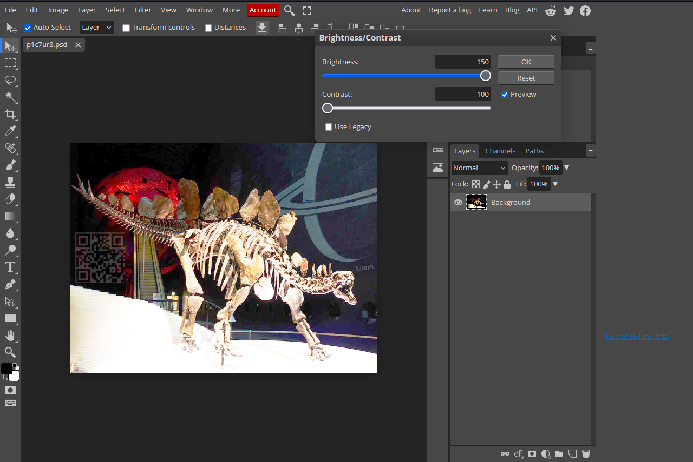
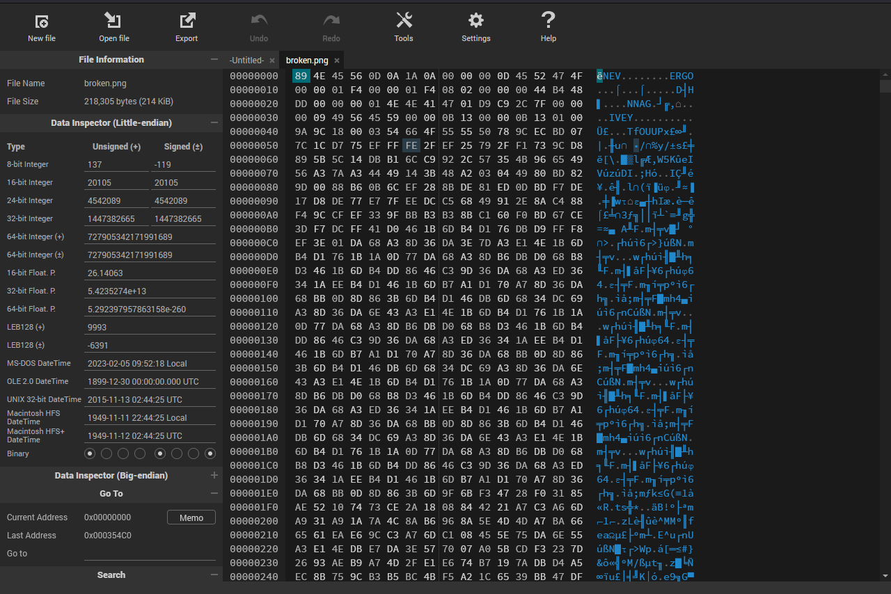
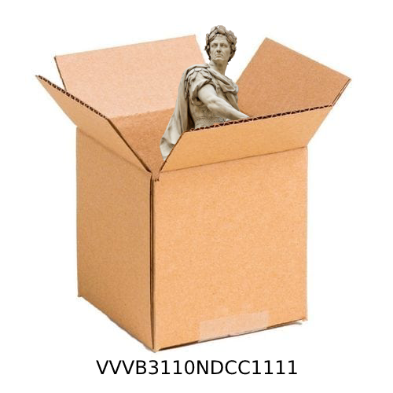

# Zip Gauntlet

### Problem

The flag is stored within a nested encrypted zip file. To find the password for each zip (or stage), clues are hidden within files that are also compressed within the zip. There are six stages, labelled `stage_zero` to `stage_five`, each with their own forensics problem.

### Solution

**stage_zero**

From a README file, we are introduced to the challenge and prompted to use the password `start` to unlock the first zip.

**stage_one**

We get `p1c7ur3.jpg`, an image of a skeleton stegosaurus.

By popping the image into a photo editor (e.g. [Photopea](https://www.photopea.com/)) and adjusting the brightness and contrast, a QR code is revealed. Scanning the code gives `_w0rth_4_th0u`.

A message is also encrypted using LSB steganography: `s4nd_w0rd5`.

Adding all the leetspeak snippets together gives `p1c7ur3_w0rth_4_th0us4nd_w0rd5`, the password.

**stage_two**

The README file tells us that the password is lowercase alphabetical, meaning we can brute force the password using a password cracker like John The Ripper. You can extract the hash using `zip2john`, then run `john` on the hash. This reveals the password to be `scrabble`.

**stage_three**

Our file is `broken.png`, a broken PNG file (who would have guessed). Using a hex editor reveals the headers have been changed to a rickroll.

The headers can be replaced as follows:
* `NEV` to `PNG`
* `ERGO` to `IHDR`
* `NNAG` to `sRGB`
* `IVEY` to `pHYs`
* `OUUP` to `IDAT`

Only the first, second, and fifth replacements are required to repair the file.

This gives us this:

This is a statue with a toga in a box, implying the use of Caesar Box Cipher on the text below. Decrypting gives `v3n1v1d1v1c1b0c1` (Note: this password is in *lowercase*, though not specified anywhere).

**stage_four**

There is a text file named `clarification.txt` that tells us any letters in the password should be lowercase. There is also an audio file [`track.wav`](./track.wav). The lead chords from 1:19 to 1:46 are Morse code, signing `-- ----- .-. ... ...-- -- ..- ..... .---- -.-. ...`, or `m0rs3mu51cs` when translated.

**stage_five**

We get a file `flag`, which has the flag `wxmctf{unz1pp3d_4nd_0p3n3d_7a6970}`

**FLAG:** `wxmctf{unz1pp3d_4nd_0p3n3d_7a6970}`